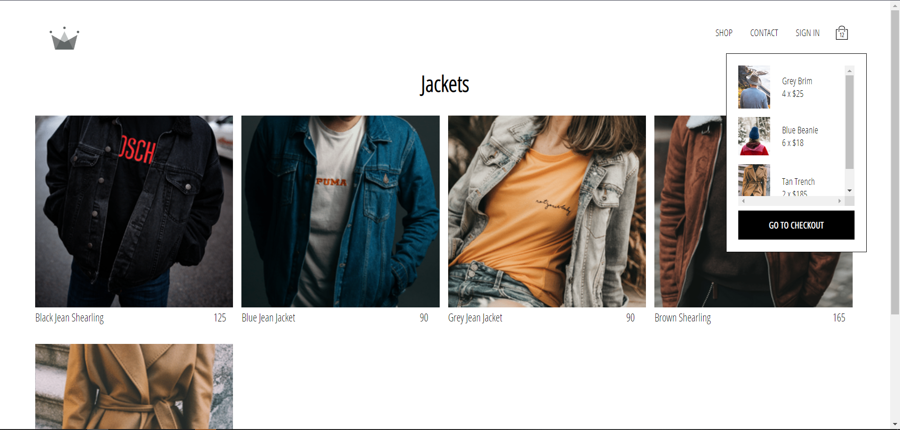
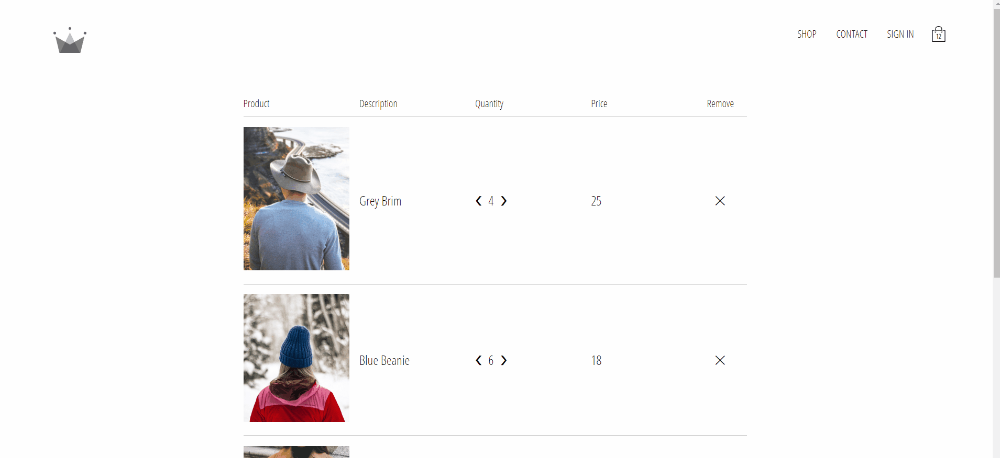

# Crwn Clothing 

This is a personnal project with React.js.
This project was made using #ReactJS #Redux #StyledComponents 


> Implementation








## Instructions

To run this project with [npm](https://docs.npmjs.com/cli/init), [Yarn](https://yarnpkg.com/lang/en/docs/cli/create/):

```bash
npm install
```

```bash
npm run start
```


